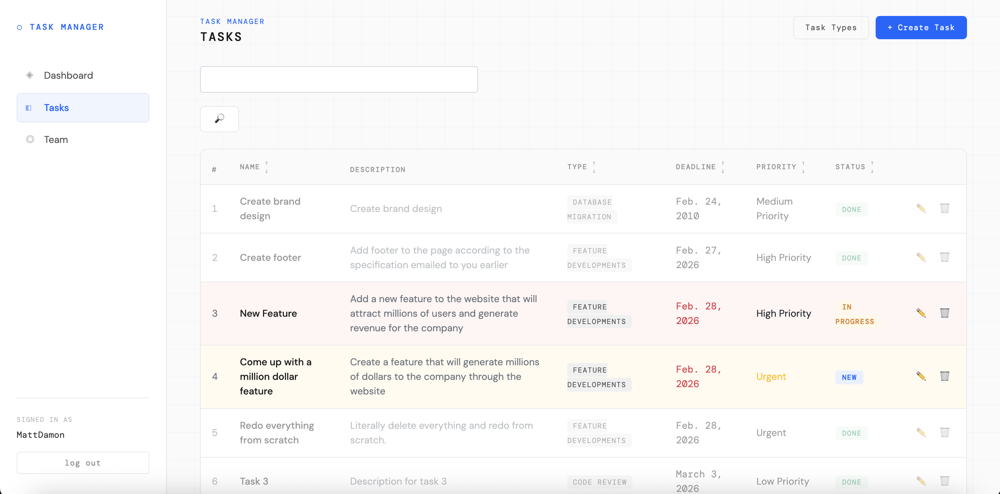

# Task manager

Django app for managing a small team of IT specialists 
with employee profiles and simple task flow.

## Check it out

[https://it-company-f6bl.onrender.com/](https://it-company-f6bl.onrender.com/)

## Installing 

Python3.12 must be already installed

```shell
git clone https://github.com/dmitriy-kds/it-company/
cd it-company
python3 -m venv venv
source venv/bin/activate
pip install -r requirements.txt
python manage.py migrate
python manage.py runserver
```

## Features

* Authentication functionality for Worker/User
* Task flow with status, deadline and assignment
* Admin panel for managing workers, tasks and task types

## Demo


